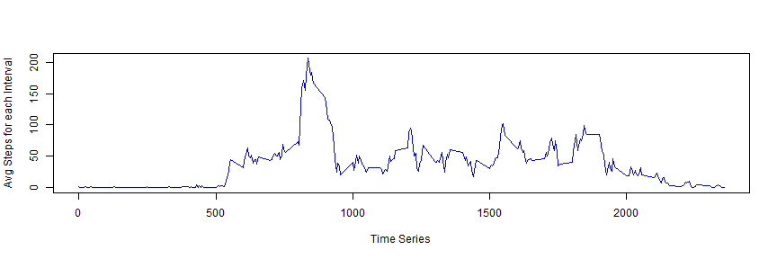

## Loading and preprocessing the data

```r
library(ggplot2)
library(dplyr)
act <- read.csv("C:/Users/arpurohit/Desktop/R/Working Directory/5thMod/activity.csv",header=TRUE,sep=",")
act$date <- as.POSIXct(act$date)
act_df <- tbl_df(act)
act_df <- filter(act_df, steps != "NA")
act_df_gb <- group_by(act_df, date)
```

## What is mean total number of steps taken per day?

```r
act_res <- summarise(act_df_gb, sum = sum(steps))
hist(act_res$sum, breaks = 20,xlab ="Cout of Steps", main ="Total Steps Per Day", col ="blue")
```

 

```r
mean_steps <- mean(act_res$sum)
median_steps <- median(act_res$sum)
```
#### Mean & Median for total number of steps per day is following :-
* 1.0766189 &times; 10<sup>4</sup>
* 10765

## What is the average daily activity pattern?


```r
act_time <- group_by(act_df, interval)
act_tm <- summarise(act_time, avg_steps = mean(steps))
with(act_tm, plot(y= avg_steps,x=interval, type="l",pch=".", lwd=1, ylab="Avg Steps for each Interval",xlab="Time Series", col = "blue"))
```

 

```r
#Interval with Max no. of steps
max_steps <- max(act_tm$avg_steps)
interval_m <- act_tm$interval[act_tm$avg_steps == max_steps]
```
#### 5-minute interval, on average across all the days in the dataset, which contains the maximum number of steps is :-
835

## Imputing missing values

```r
na_values <- is.na(act$steps) == TRUE
count_na <- sum(na_values)

#Imputing Values based on mean of 5 min interval averaged over all days
act_new <- act
for(i in 1: NROW(act)){
if (is.na(act_new$steps[i]== TRUE)){
act_new$steps[i] <- round(act_tm$avg[act_tm$interval==act_new$interval[i]],0)
}
}

act_new_df <- tbl_df(act_new)
act_ngb <- group_by(act_new_df, date)
act_nres <- summarise(act_ngb, sum = sum(steps))
hist(act_nres$sum, breaks = 20,xlab ="Cout of Steps", main ="Total Steps Per Day", col ="red")
```

 

```r
n_mean_steps <- mean(act_nres$sum)
n_median_steps <- median(act_nres$sum)
```

#### Total number of missing values in dataset is :-
2304

#### Mean & Median for total number of steps per day (after imputing missing values in original dataset) is following :-
* 1.0765639 &times; 10<sup>4</sup>
* 1.0762 &times; 10<sup>4</sup>

#### Mean & Median value got reduced slightly from last time.
#### Due to imputing missing values, total no.of steps has increased, based on histogram peak around 10000 steps has freq 15+ as compared to 10 earlier.


## Are there differences in activity patterns between weekdays and weekends?

```r
act_fin <- mutate(act_new_df, day = weekdays(date,abbreviate=TRUE))
act_fin <-  mutate(act_fin, fact = ifelse(day == "Sun" | day == "Sat", "weekend","weekday"))
act_fing <- group_by(act_fin, interval, fact)
act_final <- summarise_each(act_fing, funs(mean),steps)
g <- ggplot(data=act_final, aes(interval,steps))
g1 <- g+geom_line(aes(color=fact))+facet_grid(fact~.)+facet_wrap( ~fact, ncol=1)
print(g1)
```

 
